[[toc]]

## 13-字典「dict/Dannie」

## 1. 请使用之前的知识做出一个简易的电话本

```python
name_lst = ["aiyc", "dannie", "jaden"]
number_lst = ["123", "456", "789"]
username = input("我让你输入一个值，这个值是你要查找的用户名称，你输入的值，将会赋值给 username：")
print("username 的值是:", username)
xiabiao = name_lst.index(username)
print(xiabiao)
number = number_lst[xiabiao]
print(number)
```

```python
name=["Lyon", "Dannie", "Curtis", "Mason"]
fruit=["Grape", "Watermelon", "Orange", "kiwi"]

key_in=input("Please key in family's name:" )
print(key_in)

location=name.index(key_in)
print(location)

print_out=fruit[location]
print("His/Her favorite fruit is:",print_out)
```


---

## 电话本方法二

```python
phone_lst=["aicy","123","dannie","456","jaden","789"]
i=input()
o=phone_lst.index(i)
print(phone_lst[o+1])
```

输出：

```python
输入： jaden
输出：789
```

```python
phone_lst=["aicy","123","dannie","456","jaden","789"]
i=input("Please key in the name: " , )
o=phone_lst.index(i)
print("phone number is: ",  phone_lst[o+1])
```

输出：

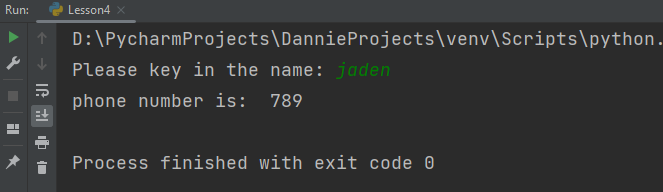

> input 有时候要写输入提示哦，不然运行起来有时候自己都会蒙的。

```python
phone_lst=["aicy","123","dannie","456","jaden","789"]
i=input("Please key in the name: " , )
o=phone_lst.index(i)
print("phone number is: ",  phone_lst[o+1])

print(phone_lst[phone_lst.index(input("please key in the name:", ))+1])
```

输出：

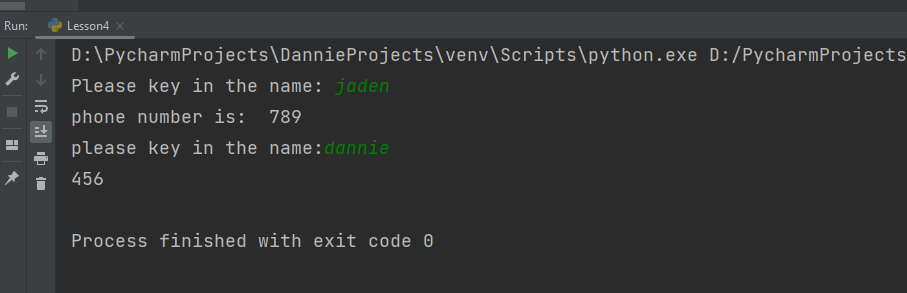

> 该一行的时候一行，不该一行写完代码的时候，不要那么写。——可读性较低

## 字典的结构

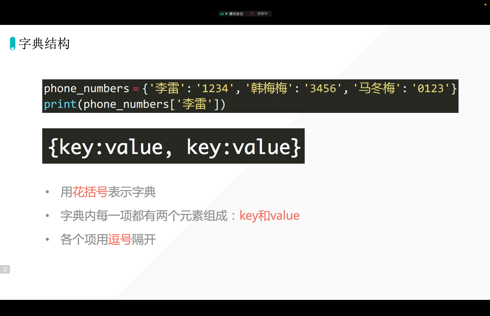

```python
phone_lst={"aicy":"123","dannie":"456","jaden":"789"}
print(type(phone_lst))
```

- key：不可变「不可以使用可变的数据类型，当作字典的 key」list：可以做 key 吗？——不可以，因为，列表可变
- 数字型可以做 key 吗？——可以，数字不可变
- 元组「tuple」可以做 key 吗？——可以，元组不可变
- 字符串「str」可以做 key 吗？——可以，字符串不可变
- 集合「set」可以做 key 吗？——不可以，集合可变
- 布尔型「bool」可以做 key 吗？——可以，bool 不可变
- value：任意数据类型

## 字典结构—key

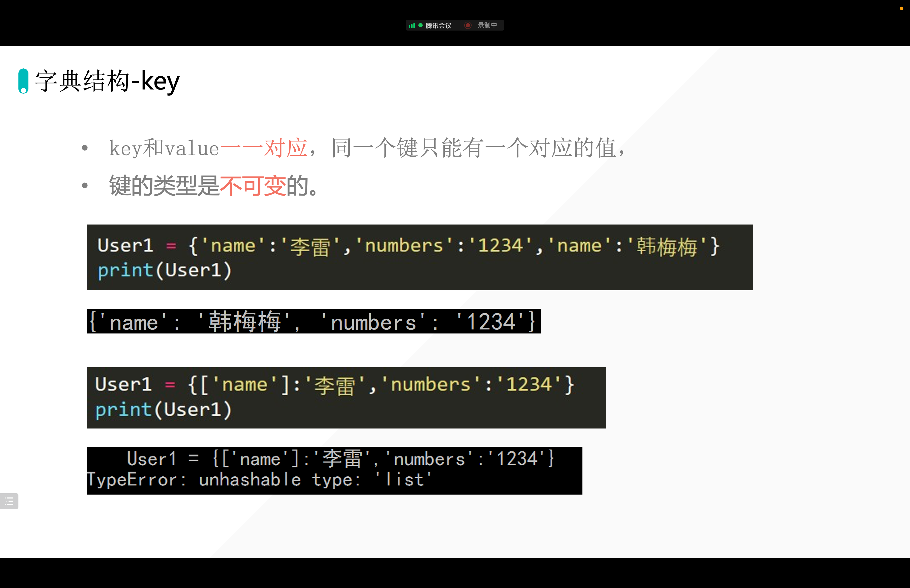

## 用字典 dict 函数创建字典

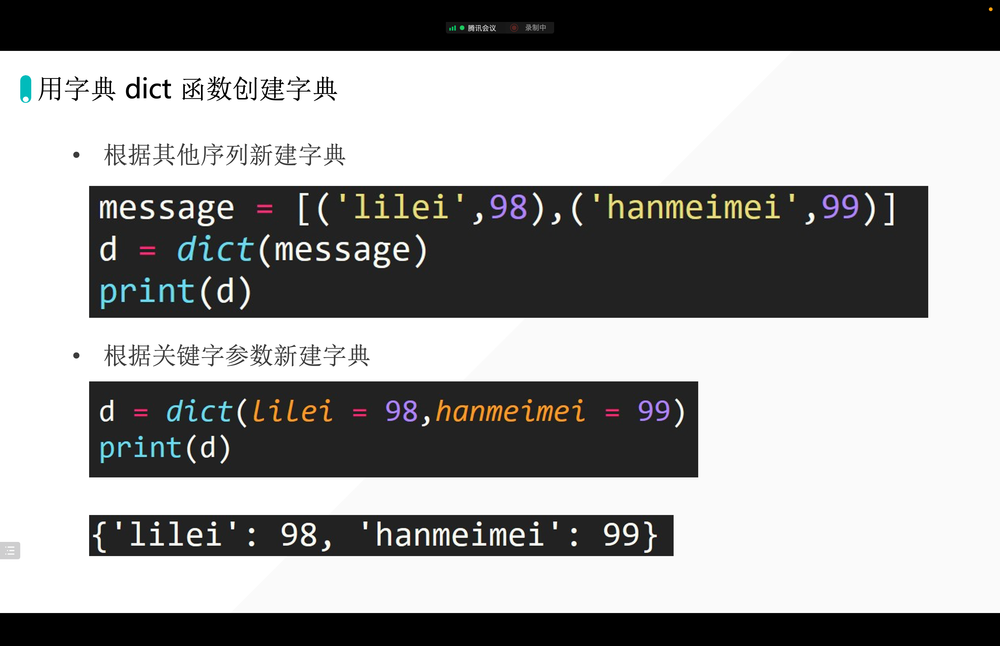

```python
phone_lst= [(["aiyc"],"123"),(["jaden"],"789")]
phone_lst_new = dict(phone_lst)
print(phone_lst_new)
```

输出： 

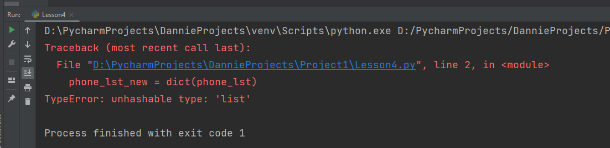

输出会有报错， 因为字典里面的元组，第一个不能是列表。


```python
d = [("aiyc", "value"),("Aiyc", "look"), (123, 223)]
print(dict(d))

d=dict( name ="aiyc", age = 19 )
print (d)
```

> 第一种写法： key, 可以不一定全部都要求是字符串， 例子里面 123 数值也做了 key
>
> 第二种的写法不能够支持全部的类型（可以做字典 key 的类型）
>
> 第二种写法， 赋值式的， 但是 key 基本上也被规定了相同的类型，比如 字符串， 后面的 age 也是字符串

## 字典提取数据

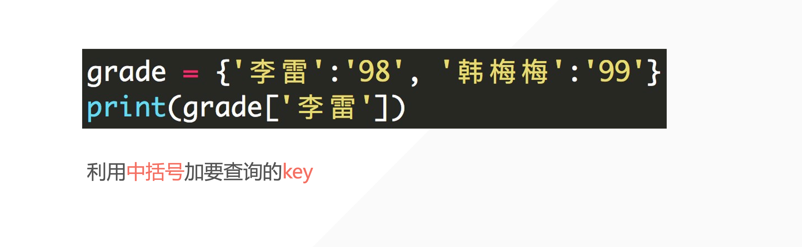

## get()

```python
d = {"name": "aiyc", "age": "18"}
# print(d["name1"])
print(d.get("name"))  # 如果 key 存在则返回值，否则默认返回 none
print(d.get("namesssss"))  # 如果 key 存在则返回值，否则默认返回 None
print(d.get("namesssss", "小主，我没有找到哦～"))  # 如果 key 存在则返回值，否则默认返回 None
```

输出：

```python
aiyc
None
小主，我没有找到哦～
```

```python
grade = { "lilei":"98", "hanmeimei": "99"}
print(grade)
print(grade.get("dannie"))
print(grade.get("dannie", "it is not exist, try again"))
```

输出：

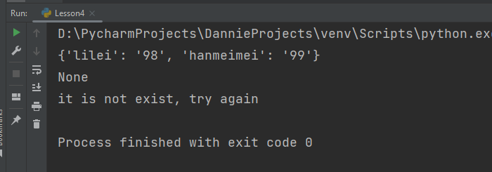


## 更新字典数据「update dict data」

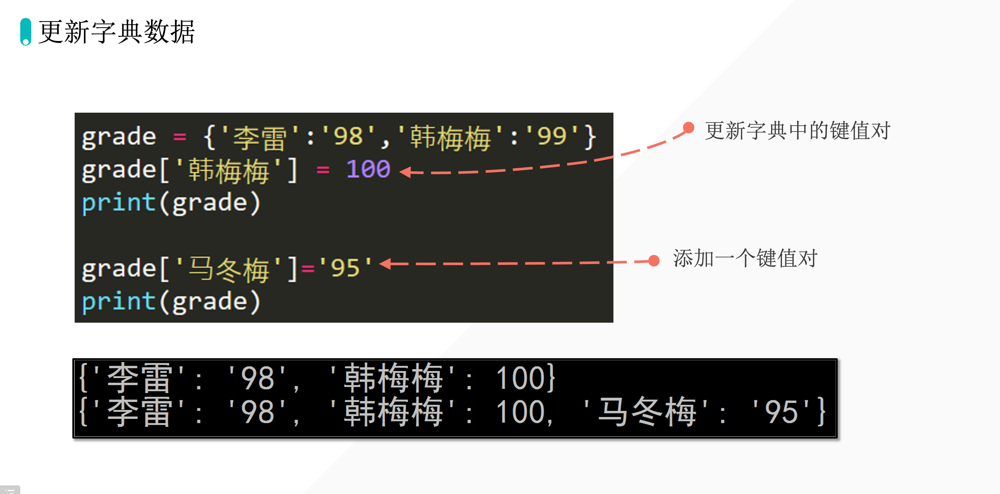

## 字典的删除「del」

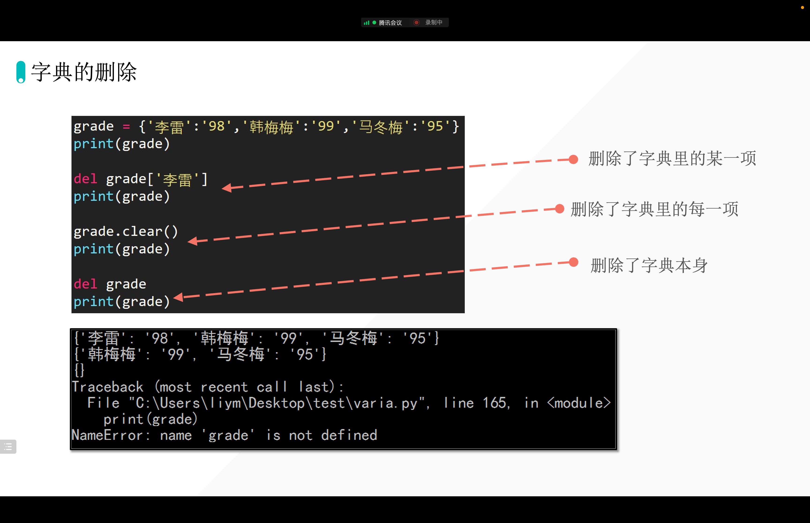

## 字典嵌套

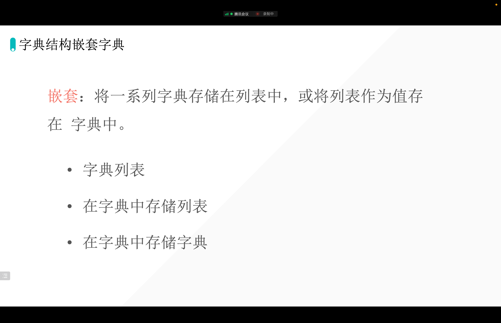

## 字典放在列表内

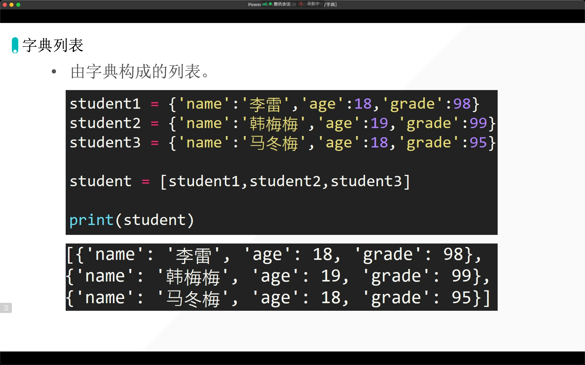

```python
favorite_class={'lilei':['Math', 'English'], 'hanmeimei':['Chinese'], 'madongmei':['Computer','Physic', 'Math']}
class2 = favorite_class ['lilei']
print (class2)
print (class2[1])

class3=favorite_class['madongmei']
print (class3)
print (class3[1])

print (favorite_class ['lilei'][1], favorite_class ['madongmei'][1], sep= ',')
```

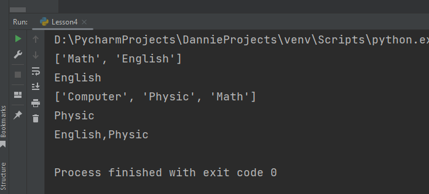


## 字典嵌套列表

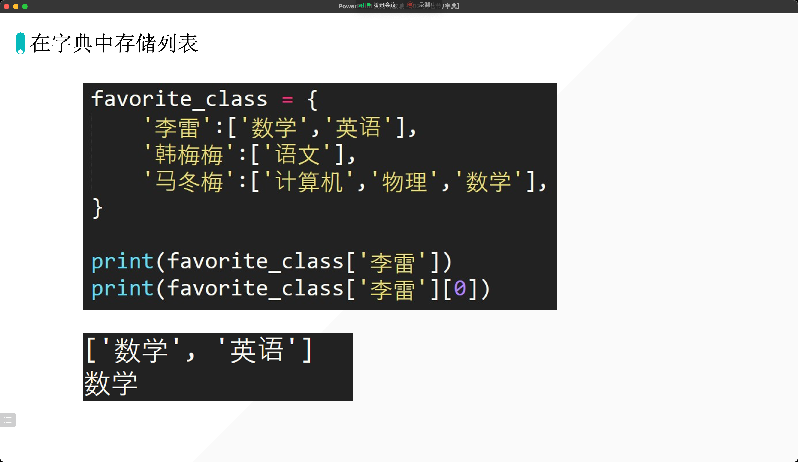

```python
student1= {'name': 'lilei', 'score': '98', 'testing_class': True}
class1 ={
    'lilei':{'score':'98', 'testing_class': True},
    'hanmeimei': {'score':'95', 'testing_class': False}
}

p1=class1['lilei']
print(p1)
print(p1['testing_class'])

p2=class1['hanmeimei']
print(p2)
print(p2['score'])

print(class1['lilei']['testing_class'], class1['hanmeimei']['score'], sep=',')
```

输出：

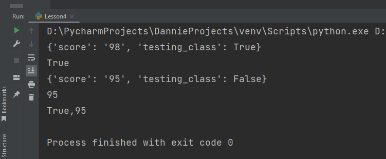

容易混淆，总结：

> 提取列表里面的数值， 是 按照位置提取 ， 如 `list_1[2]` , 就是 列表里面的 2号位的数值
>
> 但是 提取字典里面的数值， 是提取 key

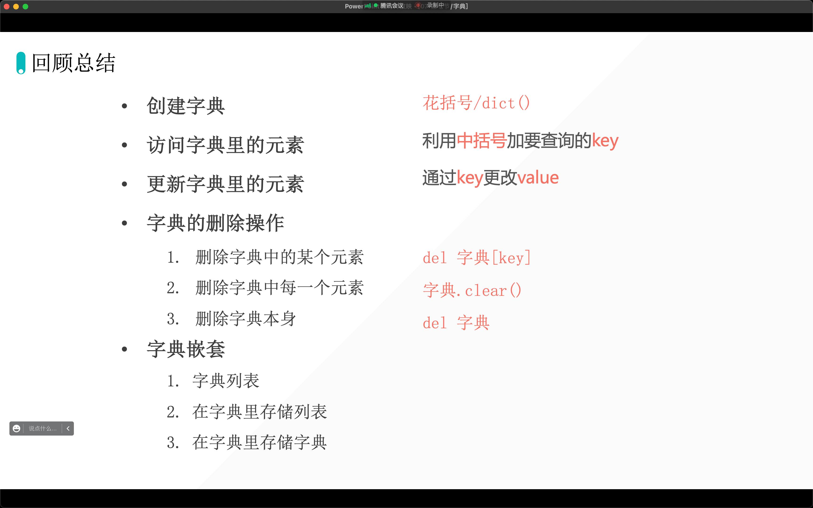

::: tip

最后一句， 如果用 `.get()` 实现。 可以这样写：

```python
print(class1.get('lilei')['testing_class'], class1.get('hanmeimei')['score'], sep=',')
```

甚至可以再继续用 `.get()`  ， 可以这样写：

```python
print(class1.get('lilei').get('testing_class'), class1.get('hanmeimei').get('score'), sep=',')
```

得出的输出也是 ：

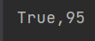

:::


欢迎关注我公众号：AI悦创，有更多更好玩的等你发现！

::: info AI悦创·编程一对一

AI悦创·推出辅导班啦，包括「Python 语言辅导班、C++ 辅导班、java 辅导班、算法/数据结构辅导班、少儿编程、pygame 游戏开发」，全部都是一对一教学：一对一辅导 + 一对一答疑 + 布置作业 + 项目实践等。当然，还有线下线上摄影课程、Photoshop、Premiere 一对一教学、QQ、微信在线，随时响应！微信：Jiabcdefh

C++ 信息奥赛题解，长期更新！长期招收一对一中小学信息奥赛集训，莆田、厦门地区有机会线下上门，其他地区线上。微信：Jiabcdefh

方法一：[QQ](http://wpa.qq.com/msgrd?v=3&uin=1432803776&site=qq&menu=yes)

方法二：微信：Jiabcdefh

:::
