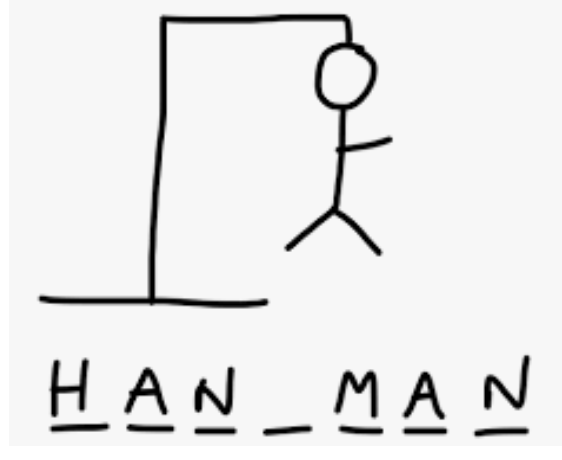

Assignment 4: Hangman Game

> 作业4:猜字游戏

NYU’s Intro to Computer Science 

> 纽约大学计算机科学导论

Section # 6 and 9

> 第6和9节

Professor Sana Odeh

> Sana Odeh教授

Due on 11/13 by Midnight!

> 截止日期是11月13日午夜!

**Design a Hangman game!**

> 设计一款猜字游戏!

**You must use arrays, methods and loops!**

> 你必须使用数组、方法和循环!

## 1 Code of Conduct

> 1行为准则

All assignments are graded, meaning we expect you to adhere to the academic integrity standards of NYU. To avoid any confusion regarding this, we will briefly state what is and isn’t allowed when working on an assignment.

Any document and program code that you submit must be fully written by yourself. You can, of course, discuss your work with fellow students, as long as these discussions are restricted to general solution techniques. Put differently, these discussions should not be about concrete code you are writing, nor about specific results you wish to submit. When discussing an assignment with others, this should never lead to you possessing the complete or partial solution of others, regardless of whether the solution is in paper or digital form, and independent of who made the solution. That means, you are also not allowed to possess solutions by someone from a different year or course, by someone from another university, or code from the Internet, etc. This also implies that there is never a valid reason to share your code with fellow students, and that there is no valid reason to publish your code online in any form.

Every student is responsible for the work they submit. If there is any doubt during the grading about whether a student created the assignment themselves (e.g. if the solution matches that of others), we reserve the option to let the student explain why this is the case. In case doubts remain, or we decide to directly escalate the issue, the suspected violations will be reported to the academic administration according to the policies of NYU (see [https://cs.nyu.edu/home/undergrad/policy.html](https://cs.nyu.edu/home/undergrad/policy.html)).

## Hangman Game Application:

> 刽子手游戏应用程序:

### Part A: Design a Hangman game using arrays, methods and loops!

> A部分:使用数组、方法和循环设计一个Hangman游戏!

Hangman is a simple word guessing game. Players try to figure out an secret word by guessing letters. If too many letters which do not appear in the word are guessed, the player is loses the game.

> 猜字游戏是一个简单的猜字游戏。玩家试图通过猜测字母来找出一个秘密单词。如果猜出的单词中没有出现的字母太多，玩家就输掉游戏。

Setup the game by drawing a gallow (see above photo or you can use any other figure, not necessarily a hanged man). Provide an underline (underscore character (`_` ) for each letter in the secret word. As letters in the word are guessed, write them in the exact position in the word replacing the underscore character with the guessed correct letter. If a letter is not in the word, draw a picture of a person on the gallow–one part for each incorrect letter guess. Most frequently, the person is drawn in 6 parts (for 6 letter guesses) in the order: head, body, left leg, right leg, left arm, right arm.

> 通过画一个绞架来设置游戏(见上图或你可以使用任何其他图形，不一定是一个被绞死的人)。为密字中的每个字母提供下划线(下划线字符(`_`))。当猜测单词中的字母时，将它们写在单词中的确切位置，用猜测的正确字母替换下划线字符。如果单词中没有字母，就画一幅绞刑架上的人的画——猜错一个字母就画一个人。最常见的是，这个人被分为6个部分(6个字母的猜测)，顺序是:头、身体、左腿、右腿、左臂、右臂。

### Here is more information:

> 以下是更多信息:

- Create an array with 10 words (animals’ names). 

> 创建一个包含10个单词(动物名称)的数组。

- Words should be selected randomly (using a random method).

> 单词应该随机选择(使用随机方法)。

- Make sure that when the player guesses the correct letter, your program should output the correct letter in the exact position, otherwise, it should keep the “`_`” in the same position.

> 确保当玩家猜测正确的字母时，你的程序应该在准确的位置输出正确的字母，否则，它应该保持“`_`”在相同的位置。

- For example, if the secret word is "cat", then you need to display underscore character “`_`” equal to length of the secret word. In this case it will display three underscore characters since the length of the string is 3 "`___`" dashes. 

> 例如，如果密字是“cat”，那么您需要显示与密字长度相等的下划线字符“' `_` '”。在本例中，它将显示三个下划线字符，因为字符串的长度是3个" ' `___` ' "破折号。

- When the user guesses the correct letter, then you have to display the letter in the correct position and also display all of the occurrences of that letter in the string. For example, if the user guessed the letter "a", then you should display the letter “a” in the correct position printing "`_a_`". Make sure to print the string after each guess.

> 当用户猜测正确的字母时，您必须在正确的位置显示该字母，并显示该字母在字符串中出现的所有次数。例如，如果用户猜出了字母“a”，那么您应该在正确的位置显示字母“a”，打印“`_a_`”。确保在每次猜测后打印字符串。

- If the user makes the wrong guess by typing "o" for example, then you should display the string with no changes such as "`_a_`" and you should **remove a piece from the stick figure or add a piece as you wish.**

> 例如，如果用户通过输入“o”做出了错误的猜测，那么您应该这样做显示没有更改的字符串，如“`_a_`”，您应该删除一部分
> 从简笔画或添加一件你想要的。

- **Use characters to draw a stickperson needed for the game such as "`_`", "O", "|" and make sure to remove one character/piece from stickperson with each wrong guess. Feel free to use other characters to draw a creative stickperson or change the figure entirely to make it more politically correct.**

> 使用字符来绘制游戏所需的stickperson，如“`_`”，“O”，“|”，并确保每猜错一次就从 stickperson 中删除一个字符/片段。你可以随意使用其他角色来画一个有创意的粘贴人，或者完全改变这个人物，使其更具政治正确性。

- The number of guesses allowed for each game is based on the number of characters in the **stick figure (usually it’s 6: two legs, two hands, body, and a face). With each wrong guess, you remove one character/piece from the stick figure. When all of the 6 characters are removed from the stick figure, then the user loses the game.** Your program should inform the user that she had won or lost the game.

> 每个游戏允许的猜测次数是基于简笔画中的角色数量(通常是6个:两条腿，两只手，身体和一张脸)。每猜错一次，就从简笔画中删除一个人物。当这6个角色都从简笔画中移除时，用户便输掉了游戏。你的程序应该通知用户她已经赢了或输了游戏。

- The player should win right away when they guess all of the letters correctly within 6 trials (there should be at least one piece in the stick figure remaining for you to win the game).

> 当玩家在6次尝试中猜对所有字母时(游戏邦注:至少要在简笔画中剩下一个字母才能让你赢得游戏)，他们便能够立即获得胜利。

- If the user lost the game, your program should print the “secret” word.

> 如果用户输了游戏，你的程序应该打印“秘密”字。

- Feel free to change the number of trials and adding an easy, medium difficulty and a hard level for this game for extra credit. 

> 你可以随意改变尝试的次数，并添加一个简单的中等难度这个游戏的难度等级可以获得额外学分。

- Make sure to write your own code and NOT to copy any line(s) from the web, classmates or any other resources! You will get a zero.

> 确保写你自己的代码，而不是复制任何一行(s)从网络，同学或任何其他资源!你会得零分。

**Extra credit will be provided for excellent design, creativity and added technical features.** 

> 优秀的设计，创意和额外的技术将提供额外的学分特性。

### Part B:

Redesign the above hangman/snowperson application from above, but now you need to get the data (the words) from a file on your computer called animals.txt. The program should read the words one line at time from the file and then assign the words to an array. Then follow the same code as you did for part1. 

> 从上面重新设计上面的 hangman/snowperson 应用程序，但是现在您需要从计算机上名为 `animals.txt` 的文件获取数据(单词)。程序每次从文件中一行读取单词，然后将单词分配给一个数组。然后遵循与第1部分相同的代码。

### Part C:

Redesign the same hangman application from above, but now you need to scrape /get the words from a file on the web from this link([https://cs.nyu.edu/~odeh/resources/python/animals.txt](https://cs.nyu.edu/~odeh/resources/python/animals.txt)).

Submit all `.java` and `animals.txt` files (make sure to include the `.txt`) when done through brightspace. 

> 提交所有的。java和 animal .txt 文件(确保包含。txt文件) brightspace。

Please let us know if you need help as we are happy to help.

> 如果您需要帮助，请让我们知道，因为我们很乐意帮助。

### Grading

| Description「Description」                                   | Points(/100) |
| ------------------------------------------------------------ | ------------ |
| Array and guessing the word randomly 数组和猜单词随机   | 10           |
| Game strategy- guessing the word in 6 trials  游戏策略-猜单词6次 | 35           |
| Stick figure manipulation during play (removing parts)  游戏过程中的简笔画操作(删除部分) | 10           |
| Outputting the string with each trial 在每次尝试时输出字符串 | 5            |
| Outputting the result (if games lost, or won and outputting the secret word when game is lost) 输出结果(如果游戏输了，或者赢了，当游戏输了，输出暗语) | 5            |
| Reading words from file on your computer animal.txt (Use try and catch) animal.txt(使用try and catch) | 15           |
| Reading files from the web 从网上读取文件               | 15           |
| Code aesthetics (comments, readability of code, style, variable naming, etc.) 代码美学(注释、代码可读性、样式、变量命名等) | 5            |

**Extra credit will be provided for excellent design, creativity and added technical features.** 

> 优秀的设计，创意和增加的技术功能将提供额外的学分。

### Submission

> 提交

The deadline of this assignment is (11/13 by midnight) after its release via Brightspace. 

> 该作业的截止日期是通过Brightspace发布后(11月13日午夜)。

Place all the files needed for this assignment in a .zip folder and submit it toBrightspace. 

> 把作业所需的所有文件放在。zip文件夹中，并提交给brightspace。

Submissions via email are not accepted. Late submissions will be penalized by 5% per 24 hours and **Late homework will not be accepted after 3 days from the due date**.

> 不接受通过电子邮件提交。迟交的作业每24小时扣掉5%的扣分，**迟交的作业在交稿日期**起计3天后将不接受。

Note that your solution must work using java with no syntax errors. In case your code does not work using Java, your submission will not be graded.

> 注意，您的解决方案必须使用没有语法错误的java。如果你的代码不能使用Java工作，你的提交将不会被评分。

欢迎关注我公众号：AI悦创，有更多更好玩的等你发现！

::: details 公众号：AI悦创【二维码】

:::

::: info AI悦创·编程一对一

AI悦创·推出辅导班啦，包括「Python 语言辅导班、C++ 辅导班、java 辅导班、算法/数据结构辅导班、少儿编程、pygame 游戏开发」，全部都是一对一教学：一对一辅导 + 一对一答疑 + 布置作业 + 项目实践等。当然，还有线下线上摄影课程、Photoshop、Premiere 一对一教学、QQ、微信在线，随时响应！微信：Jiabcdefh

C++ 信息奥赛题解，长期更新！长期招收一对一中小学信息奥赛集训，莆田、厦门地区有机会线下上门，其他地区线上。微信：Jiabcdefh

方法一：[QQ](http://wpa.qq.com/msgrd?v=3&uin=1432803776&site=qq&menu=yes)

方法二：微信：Jiabcdefh

:::

