## 目录

- 图形化编程的起源与发展
- 认识源码编辑器 Kitten
- 如何利用 Kitten 创建作品

## 图形化编程的起源与发展

你好，我是悦创。

20 世纪 60 年代，美国麻省理工学院，人工智能实验室的西蒙·派普特 Seymour Papert（1928～2016）专为孩子们设计了一门叫：LOGO 的计算机语言。**LOGO 语言是一种易懂易学的结构化程序设计语言**

> **Logo** 是一种计算机[程式设计语言](https://zh.m.wikipedia.org/wiki/程序设计语言)，在 1966 年由[西摩尔·派普特](https://zh.m.wikipedia.org/wiki/西摩爾·派普特)和 Wally Feurzeig 设计[[2\]](https://zh.m.wikipedia.org/zh-hans/Logo_(程序语言)#cite_note-2)，Logo 一词源自希腊语[逻各斯](https://zh.m.wikipedia.org/wiki/邏各斯)（logos）。Logo 是一种[直译语言](https://zh.m.wikipedia.org/wiki/直譯語言)，和其他语言不同的是，它内置一套海龟绘图（Turtle Graphics）系统[[3\]](https://zh.m.wikipedia.org/zh-hans/Logo_(程序语言)#cite_note-mit.edu-3)，通过向海龟发送命令，用户可以直观地学习程序的运行过程，因此很适于初学者特别是儿童学习程序设计。
>
> Logo 的[原型](https://zh.m.wikipedia.org/wiki/原型)来自另一个计算机语言[LISP](https://zh.m.wikipedia.org/wiki/LISP)[[4\]](https://zh.m.wikipedia.org/zh-hans/Logo_(程序语言)#cite_note-cslsPreface-4)，派普特修改了 LISP 的[语法](https://zh.m.wikipedia.org/wiki/语法)使其更易于阅读。Logo 常被称作没有括号的 Lisp。Logo 继承了 Lisp 的“表”的概念，所以在函数处理等方面拥有强大的能力，也是有特殊需求的计算机科学家的好帮手[[5\]](https://zh.m.wikipedia.org/zh-hans/Logo_(程序语言)#cite_note-csls-5)。

目的在于枯燥的编程语言，形象化给小朋友们带来。

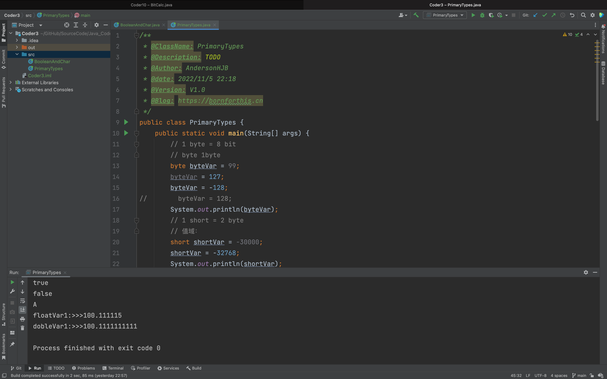

希望学生不要机械的记忆事实，希望掌握一些原始语言命令的之后，进行探索学习。通过操作屏幕上的海龟来编写程序。

强调学生计算思维和有趣的学习体验。

它具有三部分功能：

1. 编辑功能「命令与过程的编辑，使学生了解成年人，如何通过文字编辑工作的。」
2. 驱使海龟移动「绘出各种海龟的功能」

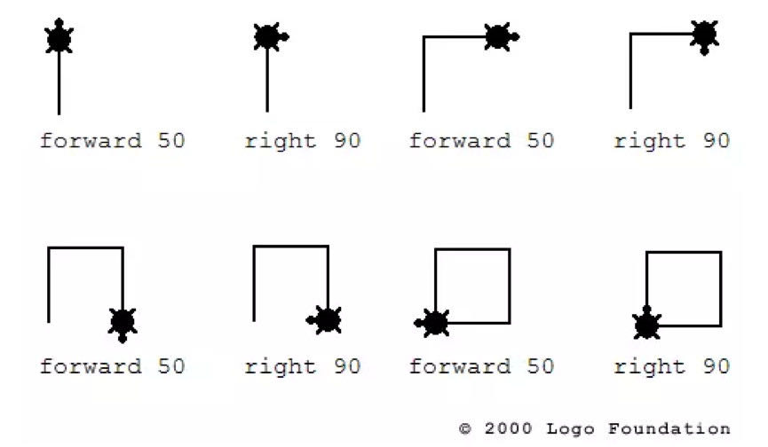

3. 制表处理 and 数值处理的功能

## 图形化编程语言进一步降低了学生学习编程的门槛

1984年时任乐高 CEO，在电视上看见了西蒙·派普特的采访节目，当时西蒙·派普特在电视中演示实体海龟，乐高 CEO 认为，LOGO 海龟和乐高的产品哲学有相通之处，二者如果能结合起来，肯定是个不错的新产品。

在与乐高接洽后，西蒙·派普特提出了一个与以往不同的想法。——能够创建一个替代电脑的乐高零部件。一个不仅具有计算功能，又能跟乐高一样小巧，且足够便宜的零部件。在当时，这是一个巨大的挑战。然而，这也将是一个巨大革命式的创新。

这个设想，直到 1998年才得已实现。那年，乐高发布了全新的可编程机器人产品：

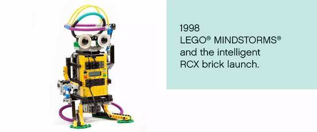

为了纪念西蒙·派普特，用了他思维风暴的书名，做了注册商标，从此乐高掀起了全球机器人风暴。

在 80 年代，同样收到 西蒙·派普特启发的还有一个青年记者，一次偶然的机会，他听到了西蒙·派普特的演讲，也由此改变了他对计算机的认知。

第二年，这个年轻记者拿着 MIT 的奖学金，参加了西蒙·派普特的研讨班，这个青年记者，就是后来的 Scratch 之父米切尔·瑞斯尼克

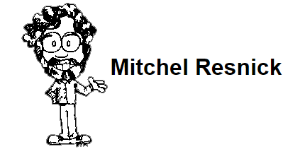

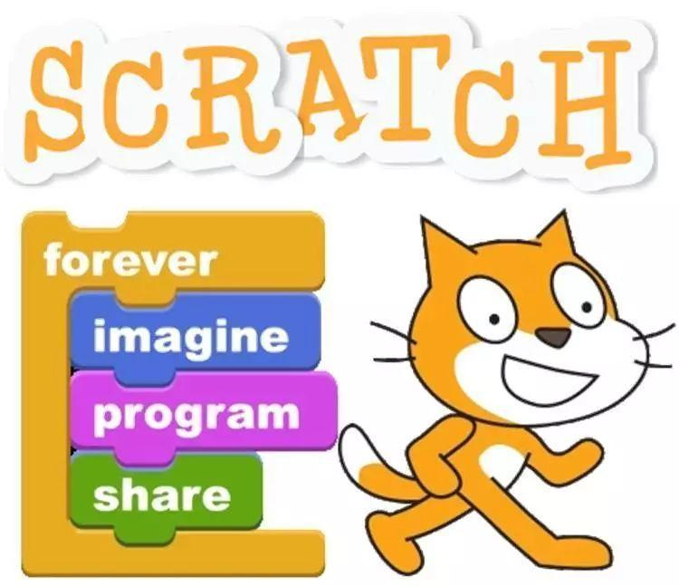

工具的进步让越来越多的孩子学习编程：

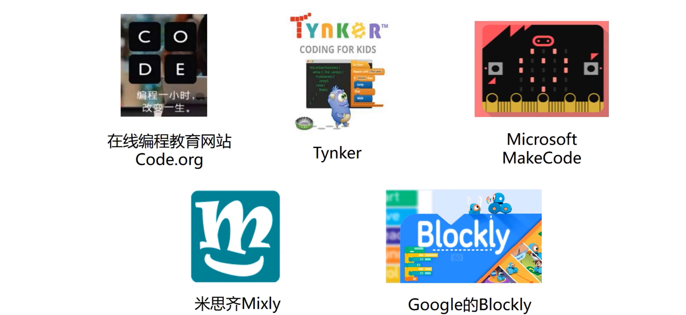

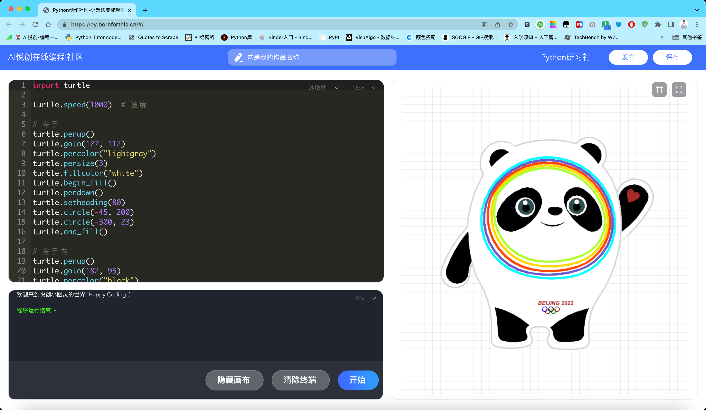

很多图形化编程平台，都是基于谷歌 Blockly。

## Kitten

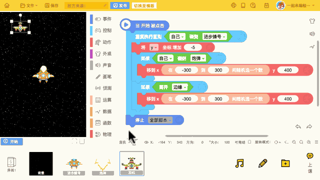

Kitten 是点猫科技自主研发的一款面向青少儿的图形化编程工具，于 2015 年发布。用鼠标拖到程序模块到脚本区并进行组合，就能进行编程，可以创作游戏、音乐、动画、故事等。

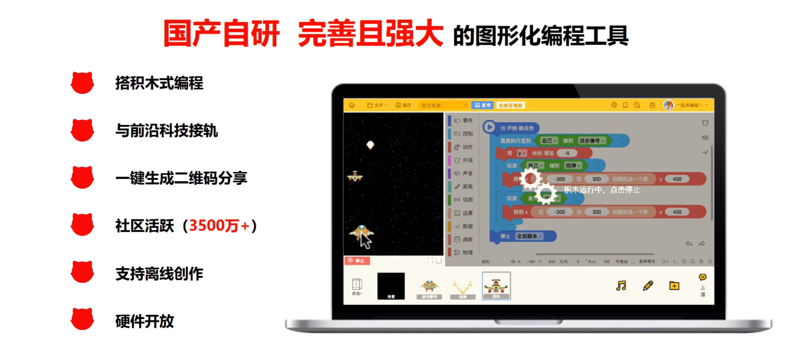

> 其实，很多时候 Scratch 也是足够使用的，我个人还是挺推荐直接使用 Scratch。竞赛啥的，大部分也是直接操作 Scratch。

- [https://scratch.mit.edu/](https://scratch.mit.edu/)

## Kitten 的不同版本

- Kitten2.0：[https://old-kitten.codemao.cn](https://old-kitten.codemao.cn)

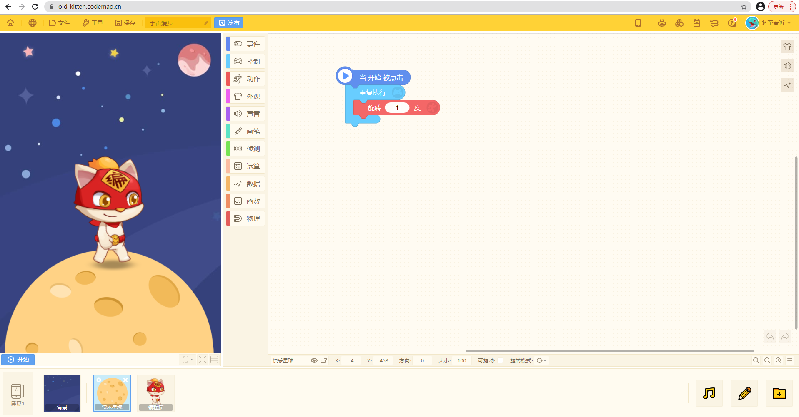

- Kitten3.0：[https://kitten.codemao.cn](https://kitten.codemao.cn)

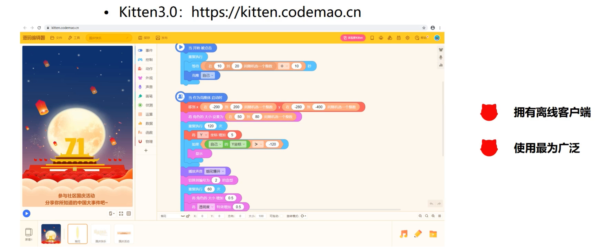

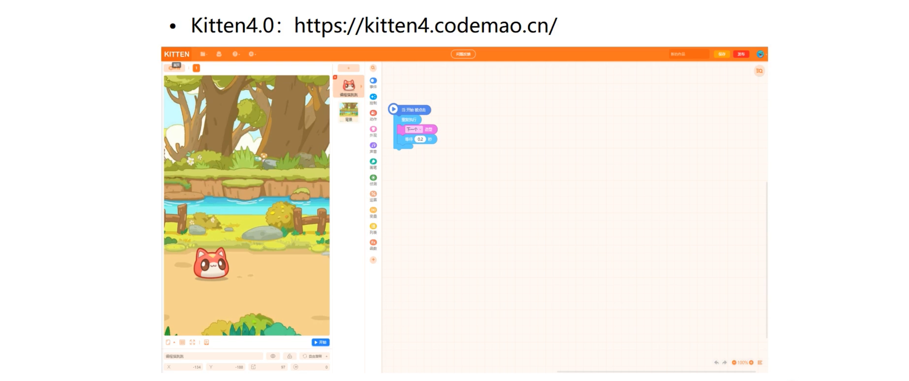

## 源码编辑器介绍

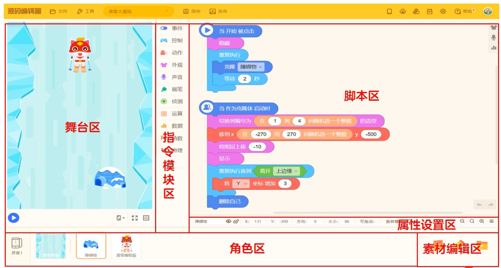

- 事件：程序（效果）的开始、暂停和结束
- 控制：控制运行流程
- 侦测：返回侦测的结果
- 数据：变量、列表
- 函数：自定义

**相似功能的积木放在同一个分类里，并且同一个分类下的积木颜色相同。**

## 如何利用 Kitten 创建作品

1. 新建空白作品
2. 添加背景
3. 添加角色
4. 添加声音

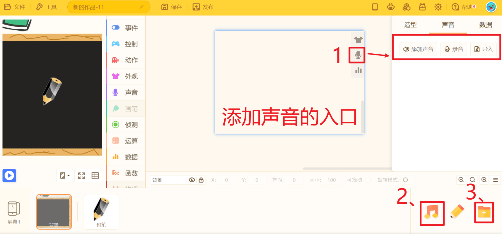

> 01.脚本区-声音；02.音乐画板-创作-保存；0.3素材库

5. 画板绘制图形「画板-绘制-保存（角色）」
6. 添加造型

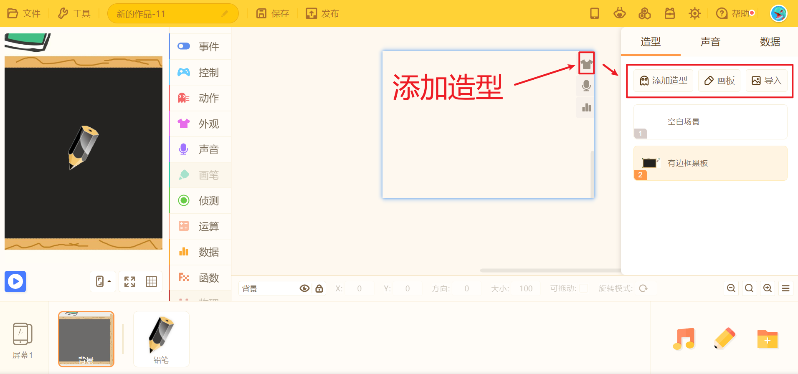

> 脚本区-造型区-添加/绘制/导入

7. 保存和分享

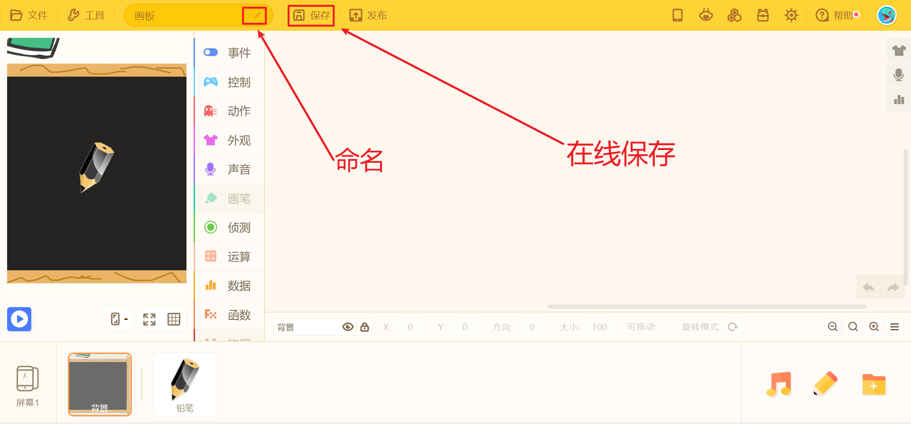

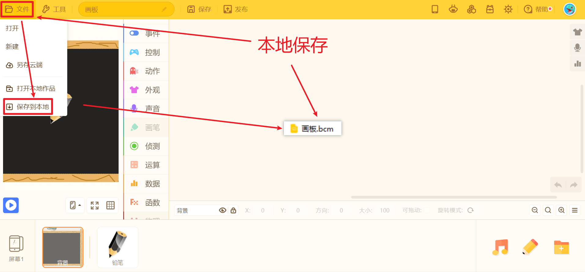

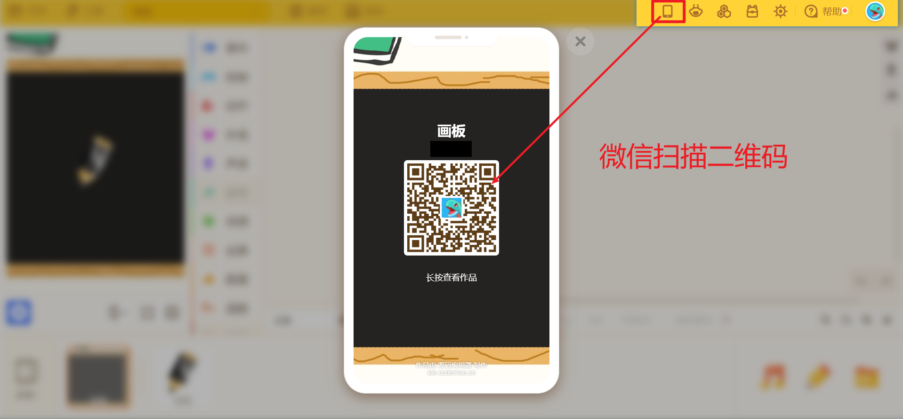

> 菜单栏-手机图标-扫码-分享作品

8. 打开与拖入

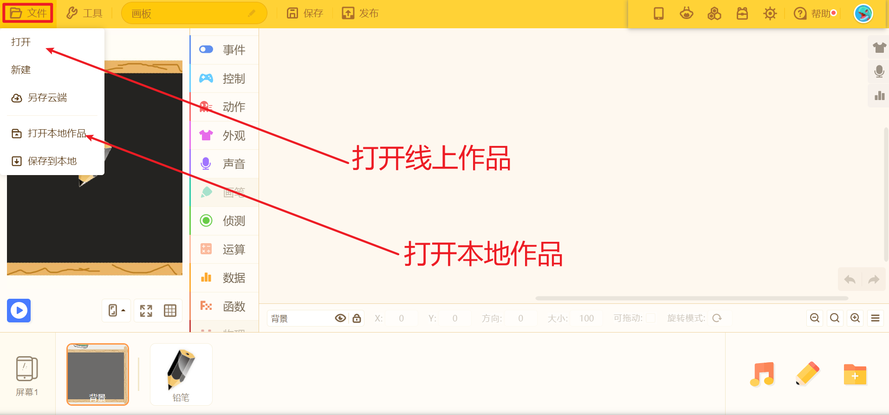

> 菜单栏-文件-打开/打开本地作品

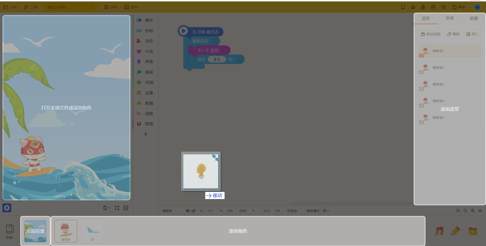

> 快捷操作-拖入图片/bcm文件

## 练一练

新建空白作品，添加任意角色和背景，给角色添加脚本，实现任意效果

## 课程回放&课程资源

- [https://www.yuque.com/aiyuechuang/scratch](https://www.yuque.com/aiyuechuang/scratch)

欢迎关注我公众号：AI悦创，有更多更好玩的等你发现！

::: details 公众号：AI悦创【二维码】

:::

::: info AI悦创·编程一对一

AI悦创·推出辅导班啦，包括「Python 语言辅导班、C++ 辅导班、java 辅导班、算法/数据结构辅导班、少儿编程、pygame 游戏开发、Web、Linux」，全部都是一对一教学：一对一辅导 + 一对一答疑 + 布置作业 + 项目实践等。当然，还有线下线上摄影课程、Photoshop、Premiere 一对一教学、QQ、微信在线，随时响应！微信：Jiabcdefh

C++ 信息奥赛题解，长期更新！长期招收一对一中小学信息奥赛集训，莆田、厦门地区有机会线下上门，其他地区线上。微信：Jiabcdefh

方法一：[QQ](http://wpa.qq.com/msgrd?v=3&uin=1432803776&site=qq&menu=yes)

方法二：微信：Jiabcdefh

:::

